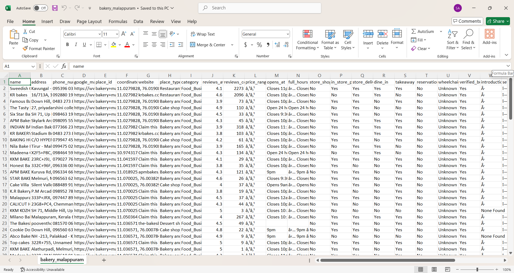

# Google Maps Business Scraper

This project contains a Python script (`scraper.py`) that automates the process of scraping business information from Google Maps. It uses Playwright to control a web browser, search for specified keywords, and extract data for each resulting business.

## Features

- **Batch Scraping**: Processes a predefined list of keywords to gather data from multiple searches.
- **Data Extraction**: Scrapes essential business details, including:
  - Name
  - Address
  - Website
  - Phone Number
  - Average Reviews & Review Count
  - Business Type and Introduction
  - Store Features (In-store shopping, pickup, delivery)
- **Automatic Categorization**: Sorts scraped businesses into categories based on the search keyword (e.g., "Food_Businesses", "Event_Catering").
- **Organized Output**: Saves results into a structured directory, creating:
  - A main folder for each scraping session, timestamped for uniqueness.
  - Subfolders for each category.
  - Individual CSV files for each keyword search.
  - A master CSV file for each category, aggregating all results.
  - A detailed log file (`scraping_log.txt`).
  - A final `SUMMARY_REPORT.txt` with statistics.
- **Duplicate Handling**: Automatically detects and removes duplicate entries based on name and address to ensure clean data.
- **Resumable Sessions**: Allows you to resume scraping from a specific keyword index, which is useful for large jobs.
- **Customizable**: Easily modify the keyword list and command-line arguments to tailor the scraping process.

## Prerequisites

- Python 3.x
- A Chromium-based browser (like Google Chrome or Microsoft Edge) installed.

## Setup

1.  **Clone the repository:**
    ```bash
    git clone https://github.com/shuhaibvvm/google-Map-leads.git
    cd google-Map-leads
    ```

2.  **Install Python dependencies:**
    It's recommended to use a virtual environment.
    ```bash
    python -m venv venv
    source venv/bin/activate  # On Windows, use `venv\Scripts\activate`
    pip install -r requirements.txt
    ```

3.  **Install Playwright browsers:**
    This command downloads the necessary browser binaries for Playwright.
    ```bash
    playwright install
    ```

## How to Run

The scraper is run from the command line.

**Basic Usage:**

To start scraping with the default settings, simply run:
```bash
python scraper.py
```

### Command-Line Arguments

You can customize the scraper's behavior using the following arguments:

-   `--max-per-keyword <NUMBER>`: Sets a maximum number of results to scrape for each keyword.
    ```bash
    python scraper.py --max-per-keyword 50
    ```

-   `--start-from <INDEX>`: Starts the scraping process from a specific keyword in the list (0-based index). This is useful for resuming an interrupted session.
    ```bash
    python scraper.py --start-from 10
    ```

-   `--base-dir <DIRECTORY_NAME>`: Specifies a custom name for the main results directory.
    ```bash
    python scraper.py --base-dir "my_business_data"
    ```

-   `--test-mode`: Runs the scraper with only the first 3 keywords from the list. This is useful for testing your setup.
    ```bash
    python scraper.py --test-mode
    ```

## Output Structure

The scraper will create a main directory (default: `scraping_results`) with a unique timestamp. Inside this directory, you will find:

```
scraping_results/
└── malappuram_businesses_20231027_103000/
    ├── Food_Businesses/
    │   ├── bakery_malappuram.csv
    │   ├── hotel_manjeri.csv
    │   └── Food_Businesses_all.csv  (Master file for this category)
    ├── Event_Catering/
    │   ├── catering_malappuram.csv
    │   └── Event_Catering_all.csv   (Master file for this category)
    ├── ... (other categories)
    ├── scraping_log.txt             (Detailed log of the entire process)
    ├── progress.json                (Internal file to track progress)
    └── SUMMARY_REPORT.txt           (A final summary of the scrape)
```

## Customization

To change the search queries, simply edit the `keywords` list inside the `main()` function in `scraper.py`. You can add or remove any search terms you need.

```python
def main():
    # Your keywords list
    keywords = [
        # Food Businesses
        "bakery malappuram", "bakery manjeri",
        # ... add your own keywords here
    ]
    # ... rest of the script
```

## Screenshot

Here's a screenshot of the scraper in action:



## License

This project is licensed under the MIT License. See the `LICENSE` file for details.

**Disclaimer:** Use this scraper at your own risk. Scraping Google Maps may be against their terms of service. The author is not responsible for any consequences of using this script.
